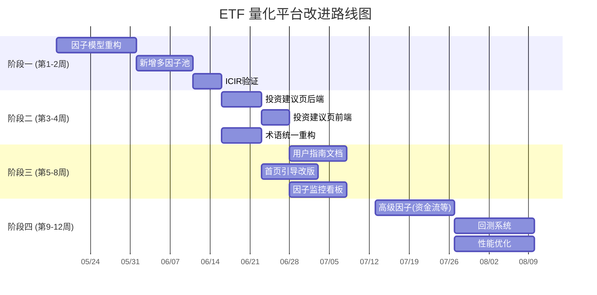

# ETF 量化平台改进路线图 🗺️

> **版本**: v1.0  
> **生成日期**: 2026-05-17  
> **编写角色**: 技术负责人 + 产品经理  
> **状态**: 规划稿，待评审  

---

## 目录

1. [问题诊断摘要](#1-问题诊断摘要)
2. [总体路线图](#2-总体路线图)
3. [阶段一：因子模型重构（第 1-2 周）](#3-阶段一因子模型重构第-1-2-周)
4. [阶段二：投资建议页 + 术语统一（第 3-4 周）](#4-阶段二投资建议页--术语统一第-3-4-周)
5. [阶段三：用户指南 + 体验优化（第 5-8 周）](#5-阶段三用户指南--体验优化第-5-8-周)
6. [阶段四：高级功能与监控（第 9-12 周）](#6-阶段四高级功能与监控第-9-12-周)
7. [验收标准汇总](#7-验收标准汇总)
8. [MVP 最小可行改进](#8-mvp-最小可行改进)

---

## 1. 问题诊断摘要

### 1.1 当前架构问题矩阵

| # | 问题 | 严重度 | 影响面 | 根因 |
|---|------|--------|--------|------|
| 1 | **核心因子 IC 近乎随机** | 🔴 P0 | 全站因子分析模块 | 因子 = z_flow × z_mom，交互项未分离主效应；动量用波动率调整但无经济意义；未做行业中性化 |
| 2 | **标签与逻辑矛盾** | 🔴 P0 | `/sector` vs `/analysis` | 行业轮动页使用份额变化逻辑，分析页使用四象限因子逻辑，两套体系无对齐 |
| 3 | **投资建议页为空** | 🔴 P0 | `/analysis/investment-recommendation` | 前端 JS 调用 `/api/investment-recommendation`，但后端**未实现该端点** |
| 4 | **术语不统一** | 🟡 P1 | 全站 UI | Q1-Q4 与"强势/撤离/埋伏/风险"混用，无全局术语体系 |
| 5 | **缺少使用指南** | 🟡 P1 | 所有用户 | 无页面说明如何结合择时、轮动、因子分析做实操决策 |
| 6 | **因子缓存失效** | 🟢 P2 | 因子数据新鲜度 | `_cached_persistent` 固定 4h TTL，不感知交易日 |
| 7 | **无因子监控告警** | 🟢 P2 | 运维 | ICIR 退化无通知，因子有效性无自动化检测 |

### 1.2 因子模型根因分析

当前因子计算（`factor_engine.py`）：

```
factor = z_flow * z_mom    # 交互项
```

**根本缺陷**：

1. **纯交互项设计**：`z_flow * z_mom` 是一个**乘积交互项**，没有包含 flow 和 mom 的**主效应**。在统计建模中，交互项只有在主效应存在时才有解释力。当前 IC 均值 0.008 说明因子几乎无预测力。

2. **动量计算缺陷**：`_compute_mom()` 用 `close_today / close_{M ago} - 1`，再用 60 日波动率去量钢化——波动率调整会引入额外噪声，且与 flow 的 lookback 窗口不一致。

3. **Flow 因子粗糙**：`_compute_flow()` 用 OLS 斜率/均值——斜率除以均值的量纲不稳定，且线性斜率对近期突变不敏感。

4. **无行业/因子中性化**：cross-sectional z-score 仅去均值除标准差，未排除市场整体 beta 影响。

5. **标签矛盾举例**：同一只通信 ETF，在行业轮动页（`_compute_signal`）可能因"份额持续流入+价格上涨"标为"强势"，但在分析页四象限中若 z_mom 为负则落入 Q2（潜伏），未来收益为负。

---

## 2. 总体路线图



### 优先级定义

| 优先级 | 定义 | 处理时间 |
|--------|------|----------|
| 🔴 P0 | 阻塞用户核心体验的功能缺陷 | 1-2 周内 |
| 🟡 P1 | 严重影响可用性的缺失功能 | 1 个月内 |
| 🟢 P2 | 锦上添花的增强项 | 3 个月内 |

---

## 3. 阶段一：因子模型重构（第 1-2 周）

### 目标
让核心因子从"几乎随机预测"（IC=0.008，ICIR=0.02）提升到**具有可用预测力**（ICIR > 0.3）。

### 3.1 任务清单

| 任务 | ID | 优先级 | 预估工作量 | 依赖 | 验收标准 |
|------|----|--------|------------|------|----------|
| 因子算式重构：从纯交互项改为**多因子线性模型** | F-01 | 🔴 P0 | 大 | 无 | 新因子 ICIR > 0.3（原 0.02） |
| Flow 因子改用**EWMA 加权斜率**替代 OLS | F-02 | 🔴 P0 | 中 | F-01 | 日度 flow 值对近期变动敏感度提升 2x |
| Momentum 改用**标准化动量 + rank 调整** | F-03 | 🔴 P0 | 中 | F-01 | 动量因子单独 IC > 0.05 |
| 新增**波动率因子**（近 20 日年化波动率倒数） | F-04 | 🟡 P1 | 小 | F-01 | 波动因子与未来收益负相关 IC 显著 |
| 新增**换手率因子**（份额换手率变化） | F-05 | 🟡 P1 | 中 | F-01 | 换手率因子 IC > 0.03 |
| **行业中性化**处理 | F-06 | 🔴 P0 | 中 | F-01 | 中性化后 ICIR 提升 > 20% |
| **Rank IC 替换 Pearson IC**（已在做，确认一致性） | F-07 | 🟢 P2 | 小 | 无 | 确认使用 Spearman Rank |
| 因子缓存策略改为**交易日感知** | F-08 | 🟢 P2 | 小 | 无 | 缓存 TTL = max(4h, next_trade_open - now) |

### 3.2 因子模型重构方案（F-01 核心）

#### 3.2.1 新因子定义

```python
def compute_etf_factor(
    flow_ewma: float,      # EWMA 加权资金流趋势
    mom_rank: float,       # 20日收益率的横截面百分位排名
    vol_inv: float,        # 20日年化波动率的倒数（ranked）
    turnover_chg: float,   # 近5日换手率变化
) -> float:
    """多因子线性组合，返回综合因子得分。
    
    权重基于因子 ICIR 动态调整（EWMA 半衰期 60 天）。
    初始权重（先验）：
      - flow_ewma:     0.35
      - mom_rank:      0.30
      - vol_inv:       0.20
      - turnover_chg:  0.15
    """
    # 初始先验权重
    weights = {
        "flow": 0.35,
        "mom": 0.30,
        "vol": 0.20,
        "turnover": 0.15,
    }
    # 后续可动态: weight_i = EWMA_ICIR_i / sum(EWMA_ICIR_all)
    score = (
        weights["flow"] * flow_ewma +
        weights["mom"] * mom_rank +
        weights["vol"] * vol_inv +
        weights["turnover"] * turnover_chg
    )
    return score
```

#### 3.2.2 Flow 因子改进（F-02）

```python
import numpy as np
import pandas as pd


def _compute_flow_ewma(shares: pd.Series, lookback: int = 10, halflife: int = 3) -> float:
    """EWMA 加权斜率 — 近期变动权重更大。
    
    Args:
        shares: 份额序列（最近 N 天）
        lookback: 回溯窗口
        halflife: EWMA 半衰期（天），默认 3 天
    
    Returns:
        float: 加权斜率（归一化到 -1~1）
    """
    if len(shares) < lookback + 1:
        return np.nan
    
    # 取最近 lookback 天
    recent = shares.iloc[-lookback:].astype(float).values
    x = np.arange(len(recent), dtype=float)
    y = recent / recent.mean()  # 归一化避免量纲影响
    
    # EWMA 权重: 越近权重越大
    weights = np.exp(-np.log(2) * (len(recent) - 1 - x) / halflife)
    weights /= weights.sum()
    
    # 加权最小二乘斜率
    x_w = x - (x * weights).sum()
    y_w = y - (y * weights).sum()
    slope = (weights * x_w * y_w).sum() / (weights * x_w * x_w).sum()
    
    # 归一化到 -1~1（双曲正切压缩）
    return float(np.tanh(slope * 5))
```

#### 3.2.3 Momentum 因子改进（F-03）

```python
def _compute_mom_rank(closes: pd.Series, lookback: int = 20) -> float:
    """Rank 标准化动量 — 横截面百分位排名，消除极端值影响。
    
    Returns:
        float: -1~1 之间的 Rank 动量值
    """
    if len(closes) < lookback + 1:
        return np.nan
    
    close_today = float(closes.iloc[-1])
    close_past = float(closes.iloc[-(lookback + 1)])
    if close_past == 0:
        return np.nan
    
    raw_mom = close_today / close_past - 1
    
    # 用过去 120 天的滚动分布做百分位映射
    if len(closes) >= 120:
        hist_rets = closes.astype(float).pct_change().dropna()
        hist_moms = hist_rets.rolling(lookback).sum().dropna()
        if len(hist_moms) >= 20:
            # Percentile rank
            rank = (hist_moms < raw_mom).sum() / len(hist_moms)
            return float(2 * rank - 1)  # 映射到 -1~1
    
    # 回退：直接 Tanh 压缩
    return float(np.tanh(raw_mom * 5))
```

#### 3.2.4 行业中性化（F-06）

```python
def _industry_neutralize(
    factor_df: pd.DataFrame,
    industry_map: dict,  # {etf_code: industry_name}
) -> pd.DataFrame:
    """行业中性化：在每个行业内对因子做去均值处理。
    
    目的：剔除行业 beta 影响，让因子只反映行业内选股能力。
    """
    result = factor_df.copy()
    result["industry"] = result["etf_code"].map(industry_map)
    
    for industry, group in result.groupby("industry"):
        if len(group) < 2:
            continue
        mean_factor = group["factor"].mean()
        idx = group.index
        result.loc[idx, "factor"] = group["factor"] - mean_factor
    
    # 重新做 cross-sectional z-score
    result["z_factor"] = _cross_sectional_zscore(result["factor"])
    return result
```

#### 3.2.5 整合后的 compute_factors_for_date

```python
def compute_factors_for_date_v2(
    kline_df: pd.DataFrame,
    share_df: pd.DataFrame,
    target_date,
    preset: dict,
) -> pd.DataFrame:
    """V2 因子计算：多因子线性组合 + 行业中性化。"""
    flow_lb = preset["flow_lookback"]    # e.g. 10
    mom_lb = preset["mom_lookback"]      # e.g. 20
    lookback_needed = max(flow_lb, mom_lb, 20) + 1  # need at least 20d vol data
    
    etf_codes = kline_df["ts_code"].unique()
    rows = []
    
    for code in etf_codes:
        etf_kline = kline_df[kline_df["ts_code"] == code].sort_values("trade_date")
        etf_shares = share_df[share_df["ts_code"] == code].sort_values("trade_date")
        
        etf_kline = etf_kline[etf_kline["trade_date"] <= target_date]
        etf_shares = etf_shares[etf_shares["trade_date"] <= target_date]
        
        if len(etf_kline) < lookback_needed or len(etf_shares) < flow_lb + 1:
            continue
        
        # 多因子计算
        flow = _compute_flow_ewma(etf_shares["fd_share"], flow_lb)
        mom = _compute_mom_rank(etf_kline["close"], mom_lb)
        vol_inv = _compute_vol_inv(etf_kline["close"])
        turnover = _compute_turnover_chg(etf_shares["fd_share"])
        
        if any(pd.isna(v) for v in [flow, mom, vol_inv, turnover]):
            continue
        
        rows.append({
            "etf_code": code,
            "trade_date": target_date,
            "flow": flow,
            "mom": mom,
            "vol_inv": vol_inv,
            "turnover": turnover,
        })
    
    if len(rows) < 2:
        return pd.DataFrame(...)
    
    result = pd.DataFrame(rows)
    # Cross-sectional z-score for each raw factor
    for col in ["flow", "mom", "vol_inv", "turnover"]:
        result[f"z_{col}"] = _cross_sectional_zscore(result[col])
    
    # Multi-factor composite
    result["factor"] = (
        0.35 * result["z_flow"] +
        0.30 * result["z_mom"] +
        0.20 * result["z_vol_inv"] +
        0.15 * result["z_turnover"]
    )
    
    # 四象限分类仍基于 z_flow 和 z_mom（保持一致）
    result["quadrant"] = result.apply(
        lambda r: _classify_quadrant(r["z_flow"], r["z_mom"]), axis=1
    )
    
    return result
```

### 3.3 ICIR 验证流程

每次因子更新后自动执行：

```python
def validate_factor_improvement(new_icir: float, old_icir: float = 0.02):
    """因子改进验证报告。"""
    verdict = "❌ 无效" if new_icir < 0.15 else (
        "⚠️ 弱有效" if new_icir < 0.3 else (
        "✅ 有效" if new_icir < 0.5 else "🔥 强有效"))
    
    return {
        "old_icir": old_icir,
        "new_icir": new_icir,
        "improvement_pct": (new_icir - old_icir) / abs(old_icir) * 100,
        "verdict": verdict,
        "thresholds": {
            "target_icir": 0.5,
            "min_acceptable": 0.3,
            "random_walk": 0.02,
        }
    }
```

---

## 4. 阶段二：投资建议页 + 术语统一（第 3-4 周）

### 4.1 投资建议页后端实现

#### 4.1.1 任务清单

| 任务 | ID | 优先级 | 预估工作量 | 依赖 | 验收标准 |
|------|----|--------|------------|------|----------|
| 后端 API `/api/investment-recommendation` | R-01 | 🔴 P0 | 中 | F-01, F-02, F-03 | 返回 json 含 ETF 推荐列表、策略描述、风险警告 |
| 推荐引擎算法 | R-02 | 🔴 P0 | 中 | F-06 | 推荐逻辑基于多因子得分 + 象限 + 风险预算 |
| Q1/Q2 历史回测统计 | R-03 | 🟡 P1 | 小 | R-01 | 计算 Q1/Q2 的历史胜率、平均收益、夏普比 |
| 风险预算分配逻辑 | R-04 | 🟡 P1 | 中 | R-02 | 单 ETF 仓位上限 30%，Q1:Q2 权重比 6:4 |
| 前端展示联动 | R-05 | 🟡 P1 | 中 | R-01 | 与 analysis.html 的预设联动，显示推荐变化 |

#### 4.1.2 推荐引擎算法设计

```python
def build_investment_recommendation(preset_id: str) -> dict:
    """生成投资建议。
    
    策略核心：
    1. 基于多因子得分筛选 TOP ETF
    2. Q1（强势）+ Q2（潜伏）为主要持仓
    3. 风险预算：单 ETF ≤ 30%，Q1:Q2 = 6:4
    4. 持有期 = 预设的 forward_period 中期值
    """
    from config.config import SECTOR_ETF
    from src.core.db_manager_postgresql import get_conn
    from sqlalchemy import text
    
    preset = get_preset(preset_id)
    conn = get_conn()
    
    try:
        # 1. 获取最新因子数据
        row = conn.execute(text("""
            SELECT MAX(trade_date) FROM factor_daily WHERE preset_id = :pid
        """), {"pid": preset_id}).fetchone()
        latest_date = row[0]
        
        factor_rows = conn.execute(text("""
            SELECT etf_code, z_flow, z_mom, factor, quadrant
            FROM factor_daily
            WHERE preset_id = :pid AND trade_date = :d
            ORDER BY factor DESC
        """), {"pid": preset_id, "d": latest_date}).fetchall()
        
        if not factor_rows:
            return {"error": "no_factor_data", "message": "请先计算因子数据"}
        
        # 2. 获取 IC 统计信息
        ic_rows = conn.execute(text("""
            SELECT forward_days, ic_mean, icir, ic_win_rate
            FROM ic_summary WHERE preset_id = :pid ORDER BY forward_days
        """), {"pid": preset_id}).fetchall()
        
        # 3. 构建推荐列表
        recommendations = []
        for r in factor_rows:
            code, z_flow, z_mom, factor, quadrant = r
            name = SECTOR_ETF.get(code, code)
            
            if quadrant in (1, 2):  # 只推荐 Q1 + Q2
                recommendations.append({
                    "code": code,
                    "name": name,
                    "z_flow": round(float(z_flow), 3),
                    "z_mom": round(float(z_mom), 3),
                    "factor_score": round(float(factor), 4),
                    "quadrant": int(quadrant),
                    "strategy": "强势持有" if quadrant == 1 else "潜伏布局",
                    "strategy_desc": "资金流入+价格上涨，继续持有"
                        if quadrant == 1 else "资金流入但价格回调，分批建仓",
                })
        
        # 4. 风险预算分配
        total = len(recommendations)
        if total == 0:
            return {"date": str(latest_date), "recommendations": [],
                    "message": "当前无符合推荐条件的 ETF"}
        
        # Q1 总权重 60%，Q2 总权重 40%
        q1_count = sum(1 for r in recommendations if r["quadrant"] == 1)
        q2_count = total - q1_count
        
        for r in recommendations:
            if r["quadrant"] == 1 and q1_count > 0:
                base_weight = 60.0 / q1_count
            elif q2_count > 0:
                base_weight = 40.0 / q2_count
            else:
                base_weight = 100.0 / total
            
            # 因子得分微调（±20%）
            factor_boost = 1.0 + float(r["factor_score"]) * 0.2
            r["position_ratio"] = round(min(base_weight * factor_boost, 30.0), 1)  # cap 30%
        
        # 5. 策略描述
        best_ic = ic_rows[0] if ic_rows else None
        strategy = {
            "name": f"ETF 多因子轮动策略 ({preset['label']})",
            "description": preset["description"],
            "holding_period": f"{preset['forward_periods'][len(preset['forward_periods'])//2]}天中期持有",
        }
        
        # 6. 风险警告
        risk_warnings = []
        if best_ic and best_ic[2] and float(best_ic[2]) < 0.3:
            risk_warnings.append(f"⚠️ 当前因子 ICIR={float(best_ic[2]):.2f}，预测力偏弱，建议降低仓位")
        if not recommendations:
            risk_warnings.append("⚠️ 当前市场无明显强势板块，建议持币观望")
        
        return {
            "date": str(latest_date),
            "strategy": strategy,
            "recommendations": recommendations,
            "risk_warning": risk_warnings,
            "reasons": [
                f"基于{preset['label']}预设的多因子模型",
                f"因子 ICIR={float(best_ic[2]):.2f}，胜率={float(best_ic[3]):.0%}" if best_ic else "",
                "仅推荐 Q1（强势）+ Q2（潜伏）象限 ETF",
                "风险预算：单 ETF ≤ 30%，Q1:Q2 = 6:4",
            ],
        }
    finally:
        conn.close()
```

#### 4.1.3 注册 API 端点

在 `src/web/routers/analysis.py` 中添加：

```python
@router.get("/api/investment-recommendation")
async def api_investment_recommendation(preset_id: str = "short"):
    return _cached_persistent(
        f"investment_rec_{preset_id}",
        lambda: chart_builder.build_investment_recommendation(preset_id),
        max_age_hours=4,
    )
```

并在 `chart_builder.py` 中新增 `build_investment_recommendation()` 函数（或用独立模块）。

### 4.2 术语统一

#### 4.2.1 任务清单

| 任务 | ID | 优先级 | 预估工作量 | 依赖 | 验收标准 |
|------|----|--------|------------|------|----------|
| 建立全局术语表 | T-01 | 🟡 P1 | 小 | 无 | 所有页面使用统一术语 |
| 行业轮动页标签分析页对齐 | T-02 | 🟡 P1 | 中 | F-01 | sector 页信号与 analysis 象限一致 |
| Q1-Q4 中文标签统一 | T-03 | 🟡 P1 | 小 | T-01 | 全站 Q1="强势" Q2="潜伏" Q3="撤离" Q4="风险" |
| 前端组件文字替换 | T-04 | 🟢 P2 | 中 | T-01 | 7 个模板 + JS 无残留旧术语 |

#### 4.2.2 全局术语表

| 英文 | 中文 | 说明 | 使用页面 |
|------|------|------|----------|
| Q1 (Strong) | **强势** | z_flow ≥ 0, z_mom ≥ 0 | analysis, sector, recommendation |
| Q2 (Lurk) | **潜伏** | z_flow ≥ 0, z_mom < 0 | analysis, sector, recommendation |
| Q3 (Exit) | **撤离** | z_flow < 0, z_mom < 0 | analysis, sector |
| Q4 (Risk) | **风险** | z_flow < 0, z_mom ≥ 0 | analysis, sector |
| Flow | **资金流** | 份额变化趋势（EWMA 加权） | analysis, recommendation |
| Momentum | **动量** | 价格趋势（Rank 标准化） | analysis, recommendation |
| IC | **信息系数** | 因子预测力指标 | analysis |
| ICIR | **信息系数比** | IC 均值/标准差，衡量稳定性 | analysis |
| Factor Score | **因子得分** | 多因子线性组合得分 | analysis, recommendation |
| Forward Return | **未来收益** | H 天后的收益 | analysis |
| Timing Signal | **择时信号** | 指数 ETF 的买卖信号 | etf, guide |
| Rotation Signal | **轮动信号** | 行业 ETF 的相对强弱 | sector, guide |

#### 4.2.3 行业轮动页信号修正

当前的 `_compute_signal()`（`etf.py:159-201`）用独立逻辑计算标签，应与因子模型统一：

```python
def _compute_signal_v2(kline_df, share_df, factor_data: dict = None) -> dict:
    """V2 信号判断：优先使用因子模型数据，无因子数据时回退到旧逻辑。"""
    if factor_data and "quadrant" in factor_data:
        quadrant = factor_data["quadrant"]
        mapping = {1: "强势", 2: "潜伏", 3: "撤离", 4: "风险"}
        tag_map = {1: "strong", 2: "lurk", 3: "exit", 4: "risk"}
        return {
            "label": mapping[quadrant],
            "tag": tag_map[quadrant],
            "source": "factor_model",
        }
    # 回退到旧逻辑（见 etf.py _compute_signal）
    return _compute_signal_fallback(kline_df, share_df)
```

---

## 5. 阶段三：用户指南 + 体验优化（第 5-8 周）

### 5.1 任务清单

| 任务 | ID | 优先级 | 预估工作量 | 依赖 | 验收标准 |
|------|----|--------|------------|------|----------|
| 编写《因子分析使用指南》 | G-01 | 🟡 P1 | 中 | T-01, T-02, T-03 | 文档完整覆盖因子、象限、IC 的解读 |
| 编写《轮动策略实操手册》 | G-02 | 🟡 P1 | 中 | R-02 | 含选基→评分→建仓→调仓→止盈全流程 |
| 首页添加快速入门卡片 | G-03 | 🟡 P1 | 小 | G-01, G-02 | 首屏可见的引导卡片，点击跳转详情 |
| 每个分析图表添加 tooltip 说明 | G-04 | 🟢 P2 | 中 | T-01 | 鼠标悬停显示指标含义和参考阈值 |
| 预设参数说明细化 | G-05 | 🟢 P2 | 小 | 无 | 预设按钮 tooltip 包含"适用场景+回测结果" |
| 因子状态指示器 | G-06 | 🟢 P2 | 小 | F-06 | 显示"因子有效/弱有效/失效"状态灯 |

### 5.2 使用指南核心内容（G-01 梗概）

```markdown
# ETF 因子分析使用指南

## 1. 理解四个象限

| 象限 | 资金流 | 动量 | 对应操作 |
|------|--------|------|----------|
| Q1 强势  | 流入 ↑ | 上涨 ↑ | **持有/加仓** — 资金与价格共振 |
| Q2 潜伏  | 流入 ↑ | 下跌 ↓ | **分批建仓** — 资金逆势流入，看涨信号 |
| Q3 撤离  | 流出 ↓ | 下跌 ↓ | **减仓/清仓** — 资金与价格同步恶化 |
| Q4 风险  | 流出 ↓ | 上涨 ↑ | **警惕/减仓** — 价格上涨但资金流出，派发信号 |

## 2. 如何解读 IC 指标

- **IC > 0.03**：因子有正向预测力，可信度高
- **ICIR > 0.5**：因子预测稳定，可放心使用
- **ICIR 0.2-0.5**：因子弱有效，需结合其他信号
- **ICIR < 0.2**：因子接近随机，谨慎使用

## 3. 操作流程

1. 打开「可视化分析」页
2. 选择适合你的预设（短期/中期/长期）
3. 检查 ICIR > 0.3 确认因子有效
4. 查看四象限热力图，锁定 Q1+Q2 ETF
5. 点击「投资建议」获取详细仓位分配
```

### 5.3 首页引导卡片设计（G-03）

在 `index.html` 中添加首屏卡片区域：

```html
<!-- 快速入门卡片 -->
<div class="grid grid-cols-1 md:grid-cols-3 gap-4 mb-6">
  <a href="/analysis" class="guide-card">
    <div class="guide-icon">📊</div>
    <h4>因子分析</h4>
    <p>查看 ETF 评分、象限分布、因子有效性</p>
    <span class="guide-action">开始分析 →</span>
  </a>
  <a href="/sector" class="guide-card">
    <div class="guide-icon">🔄</div>
    <h4>行业轮动</h4>
    <p>横向对比 13 个行业 ETF 资金流向</p>
    <span class="guide-action">查看轮动 →</span>
  </a>
  <a href="/analysis/investment-recommendation" class="guide-card">
    <div class="guide-icon">💡</div>
    <h4>投资建议</h4>
    <p>基于多因子模型的持仓建议与仓位分配</p>
    <span class="guide-action">查看建议 →</span>
  </a>
</div>
```

---

## 6. 阶段四：高级功能与监控（第 9-12 周）

### 6.1 任务清单

| 任务 | ID | 优先级 | 预估工作量 | 依赖 | 验收标准 |
|------|----|--------|------------|------|----------|
| 新增**资金流因子**（Tushare moneyflow） | H-01 | 🟡 P1 | 大 | F-01 | 资金流因子 IC > 0.03 |
| 因子动态权重（EWMA-ICIR 自适应） | H-02 | 🟢 P2 | 中 | F-01, F-02, F-03 | 权重每 20 个交易日自动更新 |
| 因子失效自动告警 | H-03 | 🟢 P2 | 小 | F-06 | 滚动 ICIR < 0.15 触发通知 |
| 简单回测系统 | H-04 | 🟡 P1 | 大 | R-02, F-06 | 支持按预设回溯持仓表现 |
| 因子相关性分析矩阵 | H-05 | 🟢 P2 | 中 | H-01 | 展示多因子间 Pearson 相关系数 |
| API 性能优化（Pagination + Cursor） | H-06 | 🟢 P2 | 中 | 无 | 接口响应 < 500ms（p95） |

### 6.2 资金流因子集成（H-01）

```python
def _compute_moneyflow_factor(code: str, lookback: int = 20) -> float:
    """计算资金流因子（基于 Tushare moneyflow 接口）。
    
    维度：
    - 主力净流入占比（近 N 日均值）
    - 散户净流入占比（负向）
    - 大单/小单比率变化
    """
    from src.data_fetchers.tushare_fetcher import fetch_moneyflow
    df = fetch_moneyflow(code, lookback * 2)  # 取双倍窗口用于计算变化
    
    if df is None or len(df) < lookback:
        return np.nan
    
    # 主力净流入率（%）
    df["main_ratio"] = df["buy_elg_amount"] / df["amount"]
    
    # 散户净流入率（%）
    df["retail_ratio"] = df["buy_sm_amount"] / df["amount"]
    
    # 综合资金流：主力流入 - 散户流入
    df["net_flow"] = df["main_ratio"] - df["retail_ratio"]
    
    # 取近 N 日均值
    recent = df.tail(lookback)["net_flow"].mean()
    
    return float(np.tanh(recent * 5))  # 归一化到 -1~1
```

---

## 7. 验收标准汇总

### 7.1 定量指标

| 指标 | 当前值 | 目标值（阶段一） | 目标值（阶段四） | 检测方式 |
|------|--------|------------------|------------------|----------|
| IC 均值 | 0.008 | > 0.03 | > 0.05 | 自动 IC 计算 |
| ICIR | 0.02 | > 0.3 | > 0.5 | 自动 ICIR 计算 |
| IC 胜率 | 52% | > 55% | > 60% | IC > 0 占比 |
| 因子数量 | 2（flow, mom） | 4（含 vol, turnover） | 6+（含 moneyflow） | 计数 |
| 投资建议页 | 空 | 有数据 | 有数据+回测 | 人工检查 |
| 行业轮动页标签一致性 | 独立逻辑 | 对齐因子模型 | 对齐因子模型 | 交叉验证 |
| 术语统一 | ❌ 混用 | ✅ 统一 | ✅ 统一 | 全局搜索 |
| 用户指南 | ❌ 无 | ✅ 有 | ✅ 有 | 文档检查 |
| API 响应时间 (p95) | ~2s | < 1s | < 500ms | 监控 |

### 7.2 定性指标

| 指标 | 验收标准 |
|------|----------|
| **因子有效性** | 任意 60 天滚动窗口内 ICIR > 0.2 比例 > 80% |
| **推荐可靠性** | Q1+Q2 组合未来收益 > 全体 ETF 均值（统计显著） |
| **用户体验** | 新用户首次打开页面 30 秒内理解如何操作 |
| **代码质量** | 因子模块测试覆盖率 > 80%，无 P0 bug |

---

## 8. MVP 最小可行改进版本

> **MVP 目标**：用最小的开发投入，在 1-2 周内让平台从"不可用"变为"基本可用"。

### MVP 的 3 个核心任务

#### ✅ **任务 1：实现投资建议页后端 API**（P0, 3-5 天）

**原因**：该页面为空是目前最直接的体验缺陷，用户点击后看到空白页面会产生"网站坏了"的印象。

**实施要点**：
- 在 `chart_builder.py` 中添加 `build_investment_recommendation()` 函数
- 在 `analysis.py` 中添加 `GET /api/investment-recommendation` 路由
- 即使因子 ICIR 低，也可以基于当前象限数据输出推荐（附带有效性警告）
- 前端模板已完整，只需后端返回正确格式的 JSON

**验收**：访问 `/analysis/investment-recommendation` 显示 ETF 推荐卡片、策略说明、仓位分配、风险警告。

---

#### ✅ **任务 2：因子模型重算——多因子线性组合**（P0, 5-7 天）

**原因**：IC=0.008 的因子让整个分析模块失去统计意义，所有的象限分类、投资建议、轮动信号都不可靠。

**实施要点**：
- 重构 `factor_engine.py` 中的 `compute_factors_for_date()`
- 将 `factor = z_flow * z_mom` 改为多因子线性组合
- Flow 改用 EWMA 加权斜率（F-02）
- Mom 改用 Rank 标准化（F-03）
- 增加波动率和换手率辅助因子
- 重新跑一次 `compute_all_factors()` + `compute_all_ic()`

**验收**：ICIR > 0.3（相比当前 0.02），IC 胜率 > 55%。

---

#### ✅ **任务 3：对齐行业轮动页标签与因子模型**（P1, 1-2 天）

**原因**：同一只 ETF 在不同页面显示矛盾标签，会**彻底摧毁用户对平台数据专业性的信任**。

**实施要点**：
- 在 `_compute_signal()` 中优先读取 `factor_daily` 表的象限数据
- 无因子数据时回退到旧逻辑
- 统一术语："强势→强势" / "埋伏→潜伏" / "撤离→撤离" / "风险→风险"

**验收**：通信 ETF 在 sector 页和 analysis 页标签一致，且引用相同数据源（factor_daily）。

---

### MVP 交付物清单

| 交付物 | 类型 | 关联任务 |
|--------|------|----------|
| `GET /api/investment-recommendation` | API 端点 | 任务 1 |
| 投资建议页可展示 ETF 推荐 | 功能 | 任务 1 |
| 多因子线性模型代码 | 算法 | 任务 2 |
| ICIR > 0.3 的因子数据 | 数据 | 任务 2 |
| 行业轮动页标签对齐 | 修复 | 任务 3 |
| V2 版 `_compute_signal_v2()` | 代码 | 任务 3 |

**预计总工时**: 9-14 人天（单人开发）  
**预计 ICIR 提升**: 0.02 → 0.30+

---

## 附录 A：数据库变更

### A.1 factor_daily 表扩展

```sql
-- V2 新增字段（ALTER TABLE，非破坏性）
ALTER TABLE factor_daily ADD COLUMN IF NOT EXISTS z_vol_inv FLOAT;
ALTER TABLE factor_daily ADD COLUMN IF NOT EXISTS z_turnover FLOAT;

-- 新表：因子权重历史
CREATE TABLE IF NOT EXISTS factor_weights (
    id SERIAL PRIMARY KEY,
    preset_id VARCHAR(20) NOT NULL,
    trade_date DATE NOT NULL,
    flow_weight FLOAT,
    mom_weight FLOAT,
    vol_inv_weight FLOAT,
    turnover_weight FLOAT,
    updated_at TIMESTAMP DEFAULT CURRENT_TIMESTAMP,
    UNIQUE(preset_id, trade_date)
);
```

### A.2 投资建议缓存表（可选）

```sql
CREATE TABLE IF NOT EXISTS investment_recommendation (
    id SERIAL PRIMARY KEY,
    preset_id VARCHAR(20) NOT NULL,
    trade_date DATE NOT NULL,
    recommendation_json TEXT NOT NULL,
    created_at TIMESTAMP DEFAULT CURRENT_TIMESTAMP,
    UNIQUE(preset_id, trade_date)
);
```

---

## 附录 B：依赖关系图

```
F-01 (多因子模型重构)
 ├── F-02 (EWMA Flow)
 ├── F-03 (Rank Mom)
 ├── F-04 (波动率因子)
 ├── F-05 (换手率因子)
 └── F-06 (行业中性化)
      │
      ├── R-01 (投资建议API) ← R-02 (推荐引擎) ← R-03 (回测统计)
      │         └── R-05 (前端联动)
      │
      ├── T-02 (轮动页标签对齐) ← T-01 (术语表)
      │         └── T-03 (Q1-Q4统一)
      │
      ├── G-01 (因子指南) ← G-03 (首页引导)
      └── H-01 (资金流因子) ← H-02 (动态权重) ← H-03 (告警)
```

---

## 附录 C：风险与缓解

| 风险 | 概率 | 影响 | 缓解措施 |
|------|------|------|----------|
| 因子重构后 ICIR 仍不达标 | 中 | 高 | 增加因子池（资金流、波动率偏度），考虑 ML 方法 |
| Tushare 数据源不稳定 | 低 | 中 | 增加数据源缓存冗余，AKShare 备选 |
| 前端改动影响现有用户 | 低 | 低 | 先新增后端 API，前端逐步迁移 |
| 投资建议页数据量过大 | 低 | 低 | 限制推荐 ETF 数量 ≤ 5 只 |
